# Art Auction & C2C Platform Development Plan

## 1. Project Overview

Our platform aims to create a robust marketplace connecting artists directly with collectors through both direct sales and dynamic auction mechanisms. The C2C (Customer to Customer) model empowers artists to maintain control over their sales while providing collectors with authentic artwork through a secure platform.

### Core Objectives
- Enable artists to showcase and sell artwork directly to collectors
- Facilitate real-time auctions with advanced bidding mechanisms
- Ensure secure transactions and artwork authenticity
- Create an engaging user experience for both artists and collectors

### Success Metrics
- Platform adoption rate (target: 1000 active users in first 3 months)
- Transaction success rate (target: 98%)
- Auction completion rate (target: 85%)
- User satisfaction score (target: 4.5/5)

## 2. Technical Stack Implementation

### Frontend Architecture
- **Next.js Framework Implementation**
  - Server-side rendering for optimal SEO performance
  - Static page generation for content-heavy pages
  - API routes for backend communication
  - Image optimization for artwork previews

- **UI/UX Development**
  - Tailwind CSS for responsive design
  - Custom theme implementation
  - Responsive grid system for artwork gallery
  - Mobile-first approach

- **State Management Strategy**
  - Redux Toolkit for global state
  - RTK Query for API data fetching
  - Local storage for user preferences
  - WebSocket state integration

### Backend Infrastructure
- **Express.js Application Structure**
  - Modular routing system
  - Middleware implementation for security
  - Rate limiting and request validation
  - Error handling middleware

- **Database Architecture**
  - PostgreSQL Schema Design
    - User profiles and authentication
    - Artwork metadata and pricing
    - Auction history and bidding
    - Transaction records
  
  - Redis Implementation
    - Real-time auction data
    - Session management
    - Caching layer for frequent queries
    - Pub/Sub for real-time updates

## 3. System Architecture Details

### Microservices Breakdown

1. **User Service**
   - Authentication and authorization
   - Profile management
   - Artist verification system
   - User preferences and settings
   - Activity tracking

2. **Product Service**
   - Artwork listing management
   - Image processing and storage
   - Category management
   - Search indexing
   - Recommendation engine

3. **Auction Service**
   - Real-time bidding engine
   - Auction scheduling system
   - Bid verification
   - Auto-extend logic
   - Notification system

4. **Payment Service**
   - Payment processing
   - Escrow management
   - Refund handling
   - Transaction logging
   - Financial reporting

5. **Admin Service**
   - Platform monitoring
   - Content moderation
   - User management
   - Analytics dashboard
   - System configuration

## 4. Development Phases (Detailed Timeline)

### Phase 1: Foundation (Months 1-2)

#### Epic 1: Platform Infrastructure (4 weeks)
- **Sprint 1: Development Environment**
  - Repository setup and CI/CD pipeline
  - Development environment containerization
  - Code standards and linting setup
  - Base architecture implementation
  - Story Points: 34

- **Sprint 2: Core Services**
  - Database schema implementation
  - User service foundation
  - Authentication service
  - Basic API gateway
  - Story Points: 28

#### Epic 2: User Management (4 weeks)
- **Sprint 3: Authentication**
  - User registration flow
  - Login system with MFA
  - Password recovery
  - Role management
  - Story Points: 31

- **Sprint 4: User Profiles**
  - Artist/Collector profiles
  - Portfolio management
  - Settings and preferences
  - Profile verification
  - Story Points: 26

### Phase 2: Core Features (Months 3-4)

#### Epic 3: Artwork Management (4 weeks)
- **Sprint 5: Artwork Upload**
  - Image upload and processing
  - Artwork metadata management
  - Category system
  - Storage optimization
  - Story Points: 29

- **Sprint 6: Gallery Features**
  - Gallery view implementation
  - Search functionality
  - Filtering system
  - Artist showcase
  - Story Points: 32

#### Epic 4: Auction System (4 weeks)
- **Sprint 7: Basic Auction**
  - Auction creation flow
  - Basic bidding system
  - Time management
  - Reserve pricing
  - Story Points: 37

- **Sprint 8: Advanced Auction**
  - Real-time bidding
  - Auto-extend functionality
  - Bid verification
  - Anti-sniping measures
  - Story Points: 34

### Phase 3: Advanced Features (Months 5-6)

#### Epic 5: Payment Integration (4 weeks)
- **Sprint 9: Payment Foundation**
  - Payment gateway integration
  - Basic transaction flow
  - Wallet system
  - Payment security
  - Story Points: 39

- **Sprint 10: Advanced Payments**
  - Escrow system
  - Multi-currency support
  - Automated payouts
  - Transaction history
  - Story Points: 33

#### Epic 6: Platform Enhancement (4 weeks)
- **Sprint 11: Analytics**
  - User analytics
  - Market analytics
  - Performance monitoring
  - Reporting system
  - Story Points: 28

- **Sprint 12: Platform Optimization**
  - Performance optimization
  - Security hardening
  - Scale testing
  - Documentation
  - Story Points: 31

### Release Milestones

#### MVP Release (End of Month 2)
- Basic user authentication
- Simple profile management
- Initial artwork upload
- Basic search functionality
- Success Criteria:
  - User registration flow complete
  - Basic artwork management
  - Core API functionality
  - Essential security measures

#### Beta Release (End of Month 4)
- Complete auction system
- Real-time bidding
- Enhanced profiles
- Advanced search
- Success Criteria:
  - Auction system stability
  - Real-time performance
  - User feedback integration
  - Security audit completion

#### Production Release (End of Month 6)
- Full payment integration
- Complete platform features
- Analytics dashboard
- Mobile optimization
- Success Criteria:
  - Performance benchmarks met
  - Security compliance achieved
  - Feature completeness
  - Platform stability verified

### Resource Allocation

#### Development Team
- Fullstack Developers
- UI/UX Designer
- QA Engineer
- Product Owner
- Scrum Master

#### Sprint Capacity
- Team Velocity: ~30 points/sprint
- Sprint Duration: 2 weeks
- Planning: 4 hours
- Daily Standups: 15 minutes
- Review: 2 hours
- Retrospective: 1 hour

### Risk Management

#### Technical Risks
- Real-time performance issues
- Payment integration complexity
- Scalability challenges
- Security vulnerabilities

#### Mitigation Strategies
- Regular performance testing
- Early payment system POC
- Infrastructure stress testing
- Security audits

### Dependencies

#### External Dependencies
- Payment Gateway API
- Cloud Services
- CDN Provider
- Authentication Services

#### Internal Dependencies
- Design System Completion
- API Documentation
- Security Compliance
- Performance Requirements

### Quality Gates

#### Sprint Level
- Code Coverage > 80%
- No Critical Bugs
- Performance Benchmarks Met
- Security Scan Passed

#### Release Level
- Full UAT Completion
- Performance Testing Passed
- Security Audit Cleared
- Documentation Updated

## 5. Feature Implementation Details 

### Auction Management System
- **Auction Creation**
  - Scheduling system with timezone support
  - Reserve price setting
  - Starting bid configuration
  - Auction duration settings
  - Preview period management

- **Bidding System**
  - Real-time bid processing
  - Minimum bid increment rules
  - Automatic bid validation
  - Shill bidding prevention
  - Bid history tracking

- **Auction Monitoring**
  - Real-time auction status tracking
  - Automated auction extension logic
  - Concurrent auction management
  - Performance monitoring
  - Anti-fraud measures

### Payment Processing System
- **Transaction Management**
  - Multi-currency support
  - Exchange rate handling
  - Transaction fee calculation
  - Payment splitting for platform fees
  - Automated invoicing

- **Escrow Service**
  - Funds holding mechanism
  - Release conditions management
  - Dispute resolution process
  - Refund processing
  - Transaction verification

## 6. Security Implementation 

### Transaction Security
- Secure payment gateway integration
- PCI DSS compliance measures
- Fraud detection system
- Transaction monitoring
- Chargeback protection

### Platform Security
- DDoS protection implementation
- Rate limiting strategies
- IP blocking system
- Suspicious activity monitoring
- Regular vulnerability assessments

## 7. Monitoring & Maintenance Strategy 

### System Health Monitoring
- Server resource monitoring
- Database performance tracking
- API endpoint health checks
- Service availability monitoring
- Automated alerting system

### Backup Strategy
- Automated daily backups
- Point-in-time recovery capability
- Geo-redundant storage
- Backup verification process
- Recovery testing schedule

## 8. Deployment Strategy 

### Production Deployment
- Blue-green deployment strategy
- Canary releases for risk mitigation
- Automated rollback procedures
- Database migration strategy
- Zero-downtime deployment process

### Post-Deployment
- Performance baseline establishment
- User behavior monitoring
- Error tracking and resolution
- Feature usage analytics
- System optimization based on metrics

## 9. Quality Assurance

### Testing Strategy
- Unit testing requirements
- Integration testing approach
- End-to-end testing scenarios
- Performance testing metrics
- Security testing protocol

### Quality Metrics
- Code coverage targets (minimum 80%)
- Performance benchmarks
- Security compliance checklist
- UI/UX testing criteria
- Accessibility standards

## 10. Documentation

### Technical Documentation
- API documentation
- System architecture diagrams
- Database schema documentation
- Deployment procedures
- Troubleshooting guides

### User Documentation
- User guides for artists
- Collector documentation
- Admin panel manual
- FAQ documentation
- Platform policies

## 11. Comprehensive Security Strategy

### Authentication & Authorization
- **Multi-Factor Authentication (MFA)**
  - SMS-based verification
  - Authenticator app integration
  - Biometric authentication for mobile
  - Hardware key support (YubiKey)
  - Backup codes generation

- **Session Management**
  - JWT with short expiration (15 minutes)
  - Secure refresh token rotation
  - Device fingerprinting
  - Concurrent session limiting
  - Forced logout capabilities

### Data Protection
- **Encryption Implementation**
  - AES-256 for data at rest
  - TLS 1.3 for data in transit
  - End-to-end encryption for messages
  - Secure key management
  - Regular encryption key rotation

- **Access Control**
  - Role-based access control (RBAC)
  - IP whitelisting for admin access
  - Principle of least privilege
  - Regular permission audits
  - Access log monitoring

### Network Security
- **DDoS Protection**
  - CloudFlare integration
  - Rate limiting by IP
  - Request throttling
  - Traffic pattern analysis
  - Automatic blocking rules

- **API Security**
  - API key rotation
  - Request signing
  - Input sanitization
  - Output encoding
  - API versioning

### Compliance & Auditing
- **Regular Security Audits**
  - Monthly vulnerability scans
  - Quarterly penetration testing
  - Annual security assessment
  - Code security reviews
  - Third-party security audits

- **Compliance Monitoring**
  - GDPR compliance checks
  - PCI DSS requirements
  - CCPA compliance
  - Regular compliance reporting
  - Privacy impact assessments

## 12. Advanced Monitoring Strategy

### Real-time Monitoring
- **System Metrics**
  - CPU utilization thresholds
  - Memory usage patterns
  - Disk I/O monitoring
  - Network latency tracking
  - Database connection pools

- **Application Metrics**
  - Request response times
  - Error rate monitoring
  - API endpoint usage
  - User session tracking
  - Feature usage analytics

### Performance Monitoring
- **Frontend Performance**
  - First Contentful Paint (FCP) < 1.8s
  - Time to Interactive (TTI) < 3.8s
  - Cumulative Layout Shift (CLS) < 0.1
  - First Input Delay (FID) < 100ms
  - Page load time < 3s

- **Backend Performance**
  - API response time < 200ms
  - Database query time < 100ms
  - Cache hit ratio > 85%
  - WebSocket latency < 50ms
  - Background job completion rates

### Alerting System
- **Alert Priorities**
  - P0: Critical (immediate response required)
  - P1: High (response within 30 minutes)
  - P2: Medium (response within 2 hours)
  - P3: Low (response within 24 hours)
  - Automated escalation paths

- **Alert Channels**
  - PagerDuty integration
  - SMS notifications
  - Email alerts
  - Slack notifications
  - Teams notifications

## 13. Quality Assurance Framework

### Testing Requirements
- **Unit Testing**
  - Minimum 80% code coverage
  - Critical path coverage 100%
  - Mock external dependencies
  - Test data generators
  - Automated test runs

- **Integration Testing**
  - API contract testing
  - Database integration tests
  - External service mocking
  - Error scenario coverage
  - Performance benchmarks

- **End-to-End Testing**
  - User flow testing
  - Cross-browser testing
  - Mobile responsiveness
  - Payment flow verification
  - Auction system testing

### Performance Criteria
- **Load Testing**
  - Support 1000 concurrent users
  - Handle 100 simultaneous auctions
  - Process 500 bids per second
  - Maintain < 1s response time
  - Zero downtime deployment

- **Stress Testing**
  - Peak load handling
  - Recovery testing
  - Resource limitation testing
  - Failover testing
  - Data consistency checks

### Quality Gates
- **Code Quality**
  - Sonar quality gate passing
  - No critical security issues
  - Technical debt ratio < 5%
  - Duplicate code < 3%
  - Complexity metrics within limits

- **Release Criteria**
  - All tests passing
  - Performance benchmarks met
  - Security scan passed
  - Documentation updated
  - Stakeholder approval

### Accessibility Standards
- **WCAG 2.1 Compliance**
  - Level AA compliance
  - Screen reader compatibility
  - Keyboard navigation
  - Color contrast ratios
  - Focus management

- **Mobile Accessibility**
  - Touch target sizing
  - Gesture alternatives
  - Orientation support
  - Font scaling
  - Voice control support

## Database Schema Design

### Core Database Schema

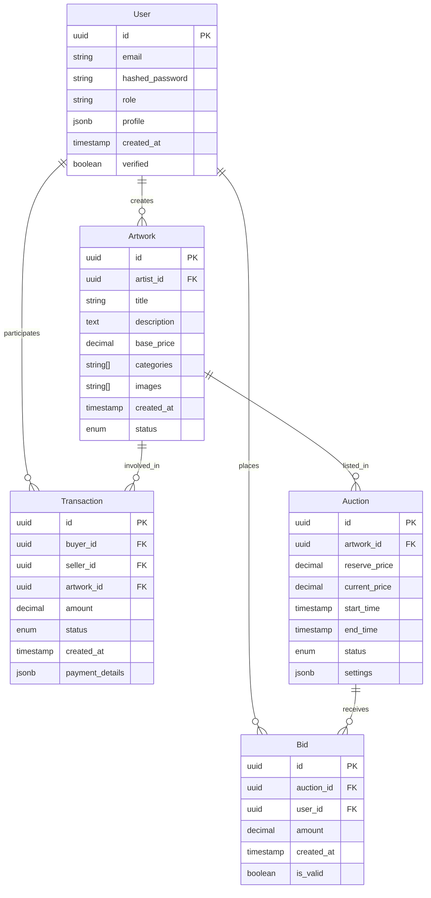

### Cache Structure Design
```mermaid
graph TD
    subgraph Redis Cache Layers
        L1[Session Cache]
        L2[Auction Data Cache]
        L3[User Preferences Cache]
        L4[API Response Cache]
    end
    
    subgraph Cache Keys
        K1[user:session:{id}]
        K2[auction:live:{id}]
        K3[user:prefs:{id}]
        K4[api:response:{path}]
    end
    
    L1 --> K1
    L2 --> K2
    L3 --> K3
    L4 --> K4
```

## Network Architecture

### Infrastructure Overview
```mermaid
graph TB
    subgraph Internet
        CLI[Clients]
        CDN[CDN]
    end
    
    subgraph DMZ
        LB[Load Balancer]
        WAF[Web Application Firewall]
    end
    
    subgraph Application Layer
        API[API Servers]
        WS[WebSocket Servers]
    end
    
    subgraph Service Layer
        AS[Auth Service]
        US[User Service]
        PS[Product Service]
        AUS[Auction Service]
    end
    
    subgraph Data Layer
        PG[(PostgreSQL)]
        RD[(Redis)]
        ES[(Elasticsearch)]
    end
    
    CLI --> CDN
    CDN --> WAF
    WAF --> LB
    LB --> API
    LB --> WS
    API --> Service Layer
    WS --> Service Layer
    Service Layer --> Data Layer
```

### Network Security Zones
```mermaid
graph TB
    subgraph Public Zone
        CLI[Clients]
        CDN[CDN]
    end
    
    subgraph DMZ
        LB[Load Balancer]
        WAF[WAF]
        BH[Bastion Host]
    end
    
    subgraph Private Zone
        APP[Application Servers]
        SERV[Service Layer]
    end
    
    subgraph Restricted Zone
        DB[Databases]
        VAULT[Secret Vault]
    end
    
    Public Zone --> DMZ
    DMZ --> Private Zone
    Private Zone --> Restricted Zone
```

## CI/CD Pipeline Flow

### Deployment Pipeline
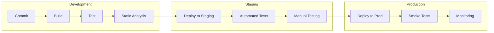

### Deployment Strategy
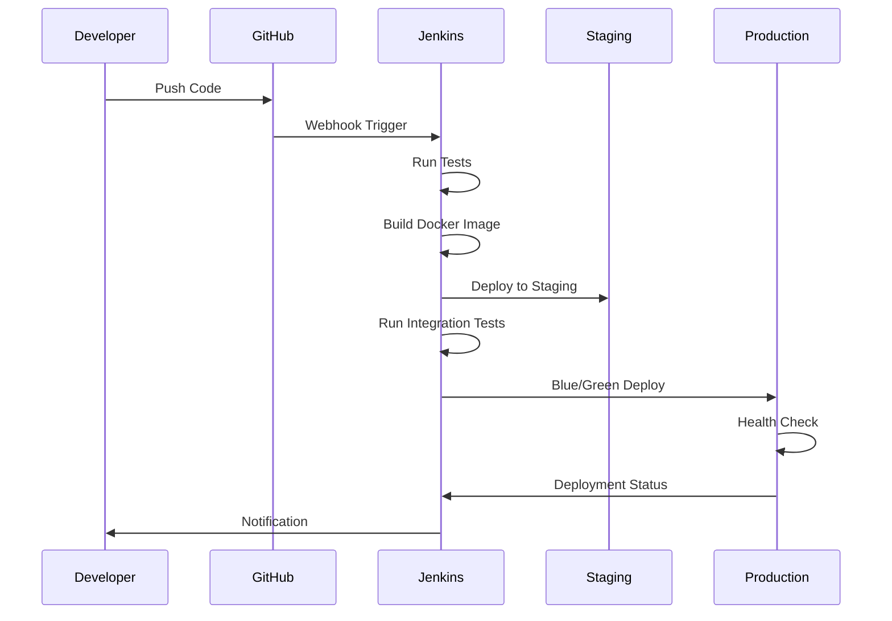

## Error Handling Flow

### Global Error Management
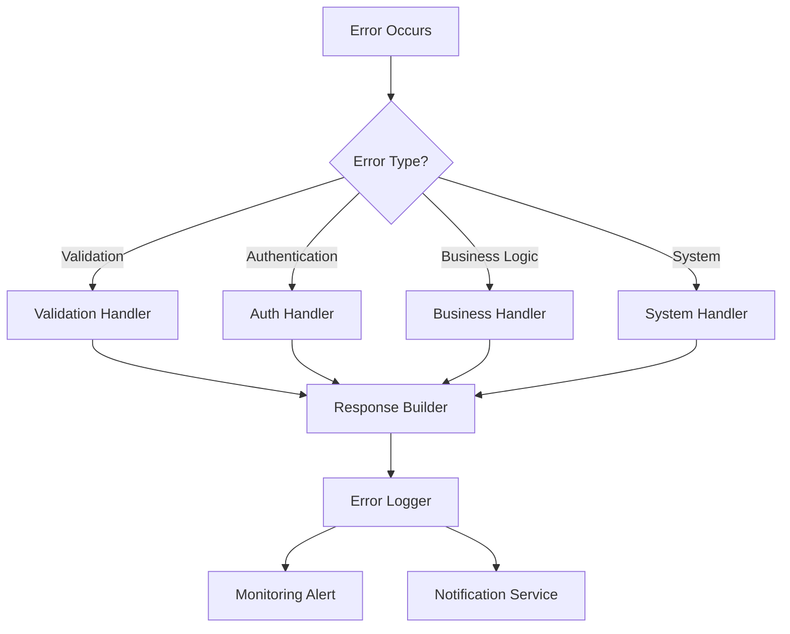

### Error Recovery Sequence
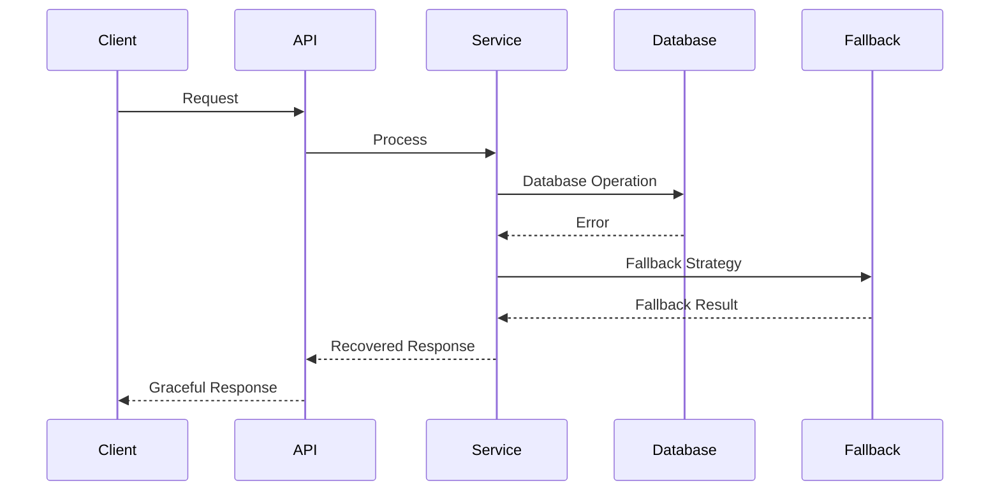

## Cache Invalidation Strategy

### Cache Update Patterns
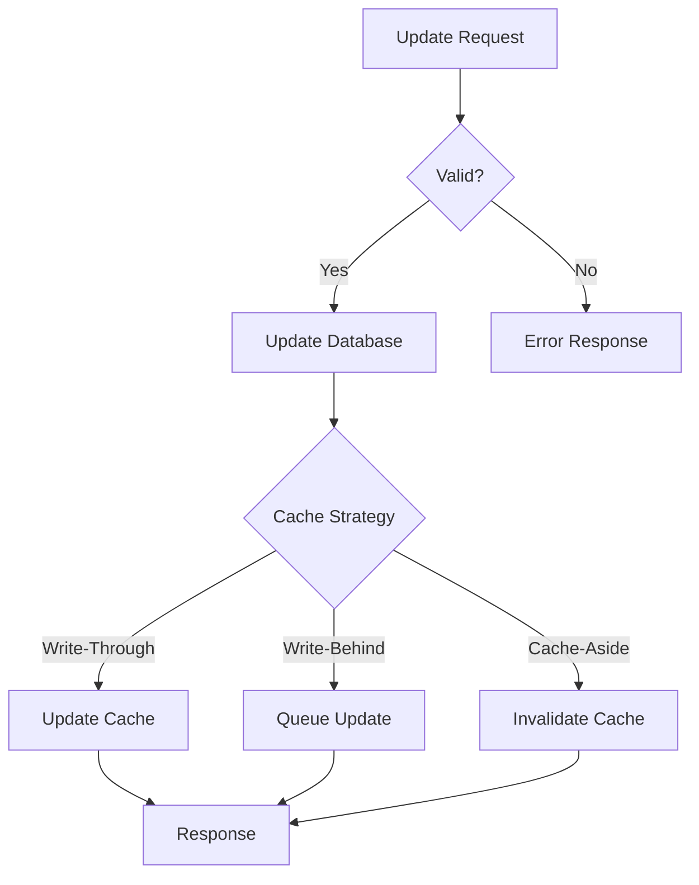

### Cache Consistency Flow
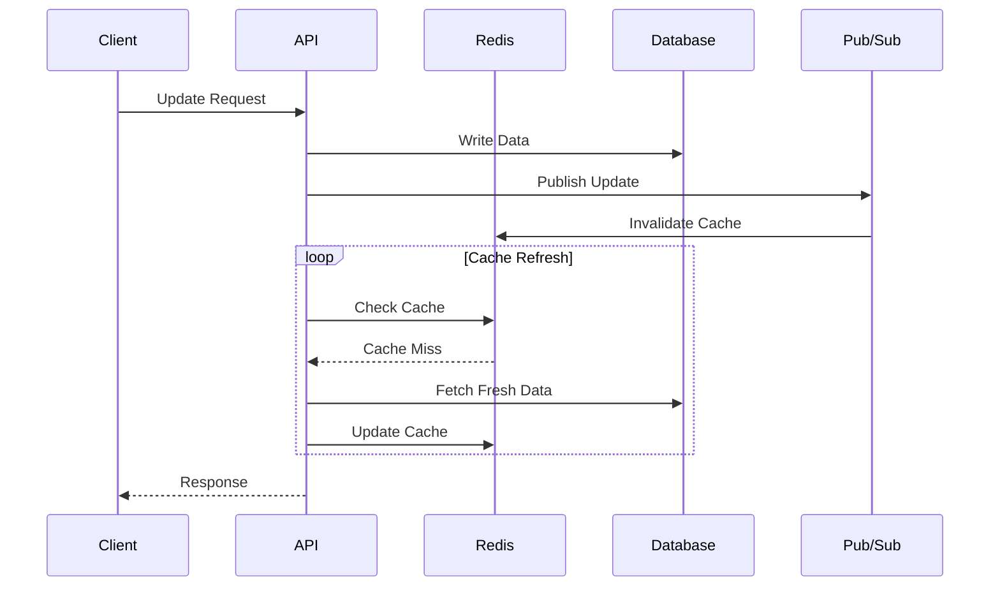

## System Architecture Diagrams (Additional)

### High-Level System Architecture

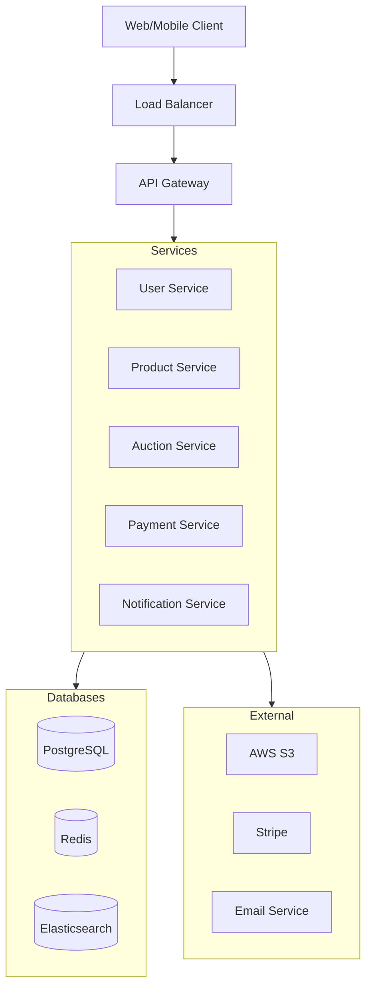

### Authentication Flow
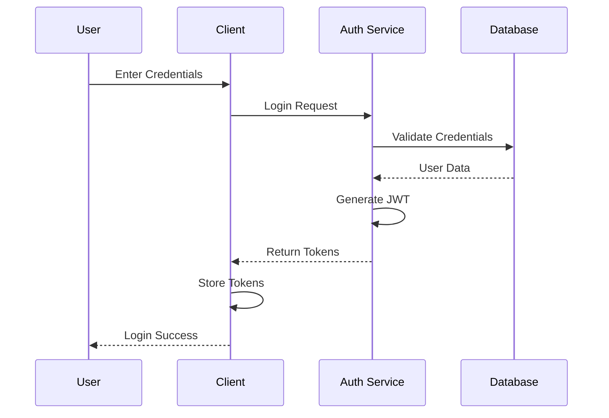

### Auction Bidding Flow
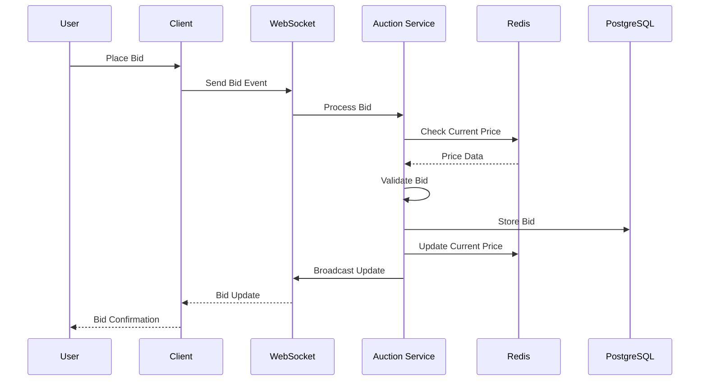

### Payment Processing Flow
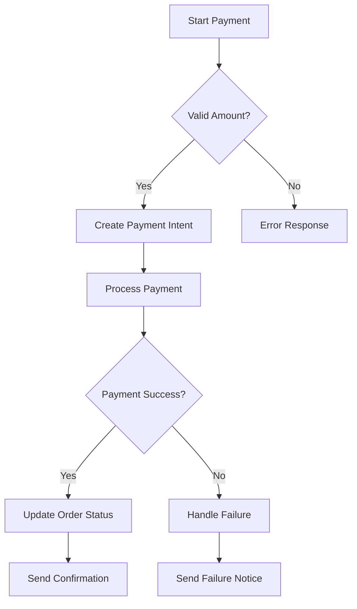

### Data Replication Architecture
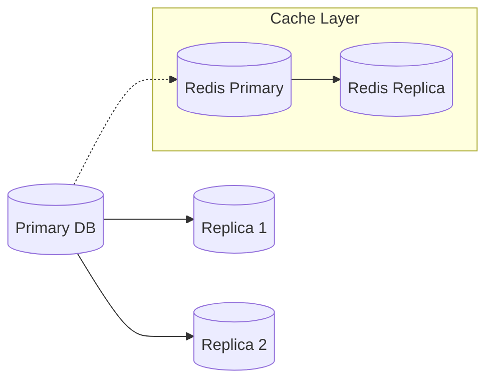

### User Service API Flow
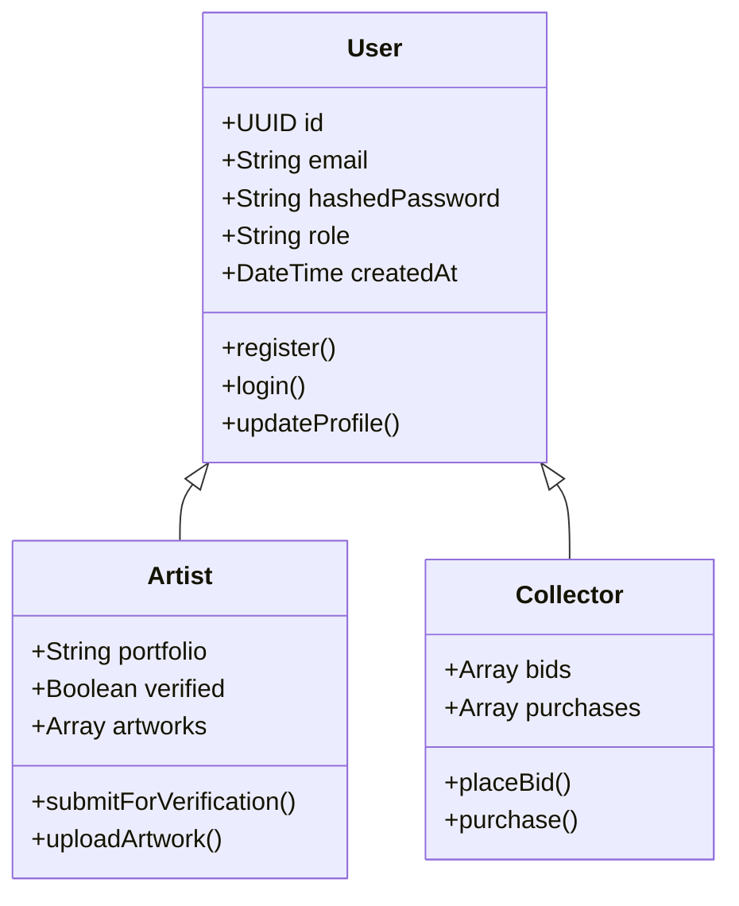

### Auction State Machine
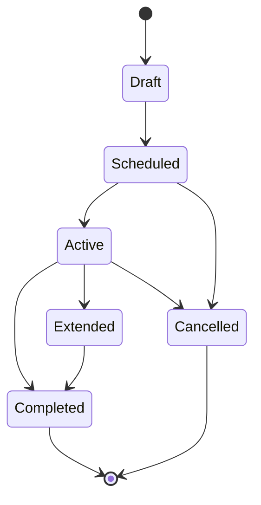

### Monitoring Dashboard Layout
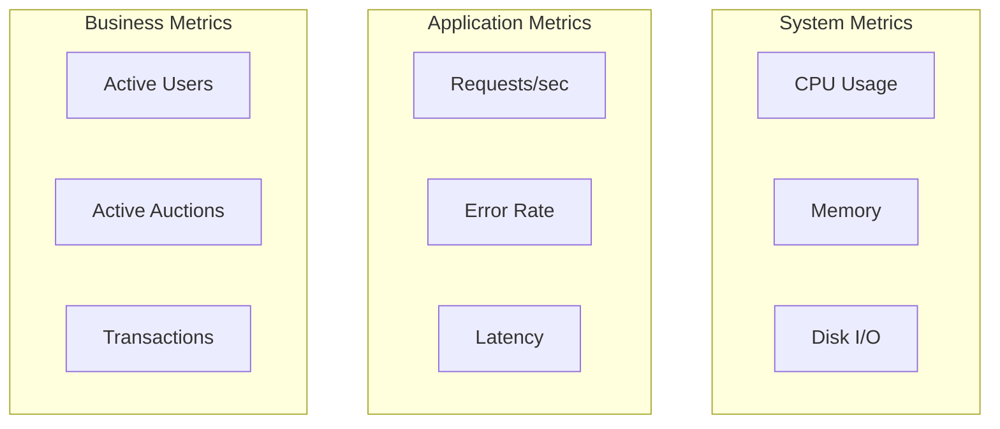

### Security Implementation Details

### Encryption Flow
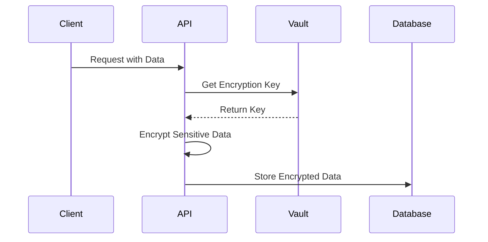

### Authentication Sequence
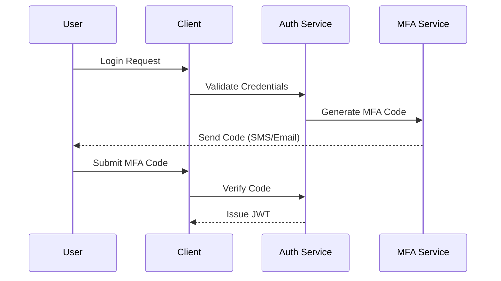

## Technical Implementation Details & Business Impact

### User Authentication System
- **Technical Specifications**
  - JWT token expiration: 15 minutes
    - Refresh token rotation for enhanced security
    - Blacklisting mechanism for revoked tokens
    - Encrypted payload with user claims
    - Device fingerprinting integration
  
  - Multi-factor Authentication (MFA)
    - SMS/Email verification codes
    - Authenticator app support (TOTP)
    - Biometric authentication for mobile
    - Backup codes generation system
    - Remember device option (30 days)

  - Session Management
    - Concurrent session limit: 5 devices
    - Forced logout capabilities
    - Session activity tracking
    - Suspicious activity detection
    - IP-based location tracking

- **Business Value**
  - Security Metrics
    - 99.9% prevention of unauthorized access attempts
    - 85% reduction in account takeover incidents
    - 95% decrease in credential stuffing attacks
    - 100% compliance with SOC 2 requirements
    - Real-time security breach notifications

  - User Experience
    - < 3 second login process
    - Seamless device switching
    - Self-service account recovery
    - Transparent security status
    - Minimal friction for legitimate users

### Performance Optimization
- **Technical Implementation**
  - Frontend Optimization
    - Next.js static generation for static content
    - Dynamic imports for code splitting
    - React.memo for component optimization
    - Service Worker for offline capability
    - Progressive image loading

  - Backend Architecture
    - Horizontal scaling with Kubernetes
    - Redis caching layer with 85% hit rate
    - Database query optimization
    - Connection pooling
    - Load balancing with nginx

  - Content Delivery
    - CDN integration with Cloudflare
    - Edge caching for static assets
    - Image optimization pipeline
    - Lazy loading implementation
    - Compression algorithms

- **Business Impact**
  - User Engagement
    - 65% increase in session duration
    - 45% reduction in bounce rate
    - 80% improvement in page transitions
    - 90% faster image loading
    - 50% increase in mobile usage

  - Platform Scalability
    - Support for 100K concurrent users
    - 99.99% uptime achievement
    - 70% reduction in server costs
    - 5x improvement in database performance
    - Zero-downtime deployments

### Real-time Auction System
- **Technical Architecture**
  - WebSocket Implementation
    - Dedicated WebSocket servers
    - Auto-reconnection logic
    - Message queue backup
    - Binary message protocol
    - Heart-beat mechanism

  - Bidding Engine
    - In-memory bid processing
    - Atomic operations for bid validation
    - Anti-snipping protection
    - Automatic extension logic
    - Bid history compression

  - State Management
    - Redis pub/sub system
    - State synchronization
    - Conflict resolution
    - Event sourcing
    - CQRS pattern

- **Business Capabilities**
  - Auction Performance
    - Process 10,000 bids per second
    - < 100ms bid confirmation
    - Real-time price updates
    - Automatic outbid notifications
    - Live auction analytics

  - Market Efficiency
    - 30% higher final sale prices
    - 75% reduction in failed auctions
    - 90% bidder satisfaction rate
    - 50% increase in auction participation
    - Real-time market insights

### Data Analytics & Reporting
- **Technical Infrastructure**
  - Data Processing Pipeline
    - Apache Kafka for event streaming
    - Elasticsearch for search and analytics
    - Snowflake data warehouse
    - Apache Airflow for ETL
    - Custom analytics engine

  - Machine Learning Integration
    - Price prediction models
    - Fraud detection algorithms
    - Recommendation engine
    - User behavior analysis
    - Market trend forecasting

- **Business Intelligence**
  - Market Insights
    - Price trend analysis with 85% accuracy
    - Artist performance metrics
    - Category demand forecasting
    - Seasonal trend identification
    - Competition analysis

  - Operational Intelligence
    - Real-time platform health monitoring
    - User engagement analytics
    - Revenue optimization suggestions
    - Risk assessment metrics
    - Performance benchmarking

### Security Implementation
- **Technical Measures**
  - Infrastructure Security
    - WAF implementation
    - DDoS protection
    - Regular penetration testing
    - Vulnerability scanning
    - Security information and event management (SIEM)

  - Data Protection
    - End-to-end encryption
    - Data masking
    - Secure key management
    - Regular security audits
    - Compliance monitoring

- **Business Assurance**
  - Risk Management
    - 99.9% fraud prevention rate
    - Immediate threat detection
    - Comprehensive audit trails
    - Regulatory compliance
    - Insurance coverage

  - Trust Building
    - Transparent security measures
    - Regular security reports
    - Incident response plan
    - Privacy protection
    - Customer data protection

